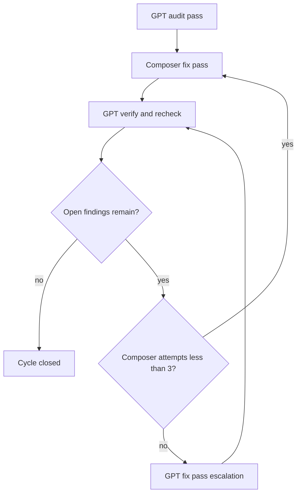

# Audit V3 Runbook

> Per-cycle workflow for GPT 5.5 Medium (audit + verify) and Composer (fix).
> Registry schema v3 — `docs/audit-units.json`.

## Commands

```text
python -m tools.audit check --profile static
python -m tools.audit run --profile ci
python -m tools.audit run --profile release
python tools/audit/migrate_v3.py
python tools/audit_coverage.py --refresh-fingerprints --write-docs
```

## Per-cycle workflow



### Step 1 — GPT 5.5 Medium: audit pass

1. Run `python -m tools.audit check --profile static`.
2. Read the current cycle units from `docs/audit-master-plan.md` (cycles 36–42 cover the extracted UI/CSS/markup layout).
3. Apply all seven lenses; record findings in `docs/audit-units.json` → `findings`.
4. Output: `dev/audit-report.md` + cycle finding checklist.

### Step 2 — Composer: fix pass (attempts 1–3)

- Fix all open findings in **canonical sources only** (`*-core.js`, `lsp-dplanner-*.css`, `ui/markup-*.html`).
- Never patch bundles or re-inline logic into `index.html`.
- Run targeted regression per fix; `npm run build:bundles` if engine cores changed.
- Increment `composer_fix_attempts` on the cycle log (max 3).

### Step 3 — GPT 5.5 Medium: verify and recheck

- Re-read every changed unit.
- Run `python -m tools.audit run --profile ci` (or `release` when required).
- Refresh fingerprints: `python tools/audit_coverage.py --refresh-fingerprints --write-docs`.
- Close findings only when evidence passes and re-read confirms resolution.

### Step 4 — Loop or escalate

| Outcome | Action |
|---|---|
| Zero open findings + suites green | Close cycle; advance |
| Open findings, Composer attempts < 3 | Return to Step 2 |
| Open findings after 3 Composer passes | Step 5 — GPT fixes directly |
| Open findings after GPT fix | GPT verify again (no Composer retry reset) |

### Step 5 — GPT escalation fix

- GPT implements fixes (same canonical-source rules).
- Note on finding: `escalated_from=composer`, `composer_attempts=3`.
- Return to Step 3.

## Cycle log (`dev/audit-cycle-log.json`)

Track per cycle:

- `cycle_id`, `units_read`, `findings_opened`, `findings_closed`
- `composer_fix_attempts` (1–3)
- `gpt_fix_escalations`
- `cycle_status`: `in_progress` | `blocked` | `closed`

**Hard rule:** Do not close a cycle or start the next until all cycle findings are closed and static audit is green.

## V3 structure gates

`SUITE-UI-STRUCTURE` validates:

| Case | Check |
|---|---|
| UI-EXTRACT-CORES | `tools/extract_ui_cores.py` |
| UI-EXTRACT-CSS | `tools/extract_ui_css.py` |
| UI-ASSEMBLE-MARKUP | `tools/assemble_ui_html.py --verify` |
| UI-SCRIPT-ORDER | Full 11-core script order |
| UI-CSS-LINK-ORDER | Four `lsp-dplanner-*.css` links |
| UI-PAGES-ASSETS | `tools/build_pages_site.py` asset list |
| UI-SW-PRECACHE | `tools/verify_sw_assets.py` |
